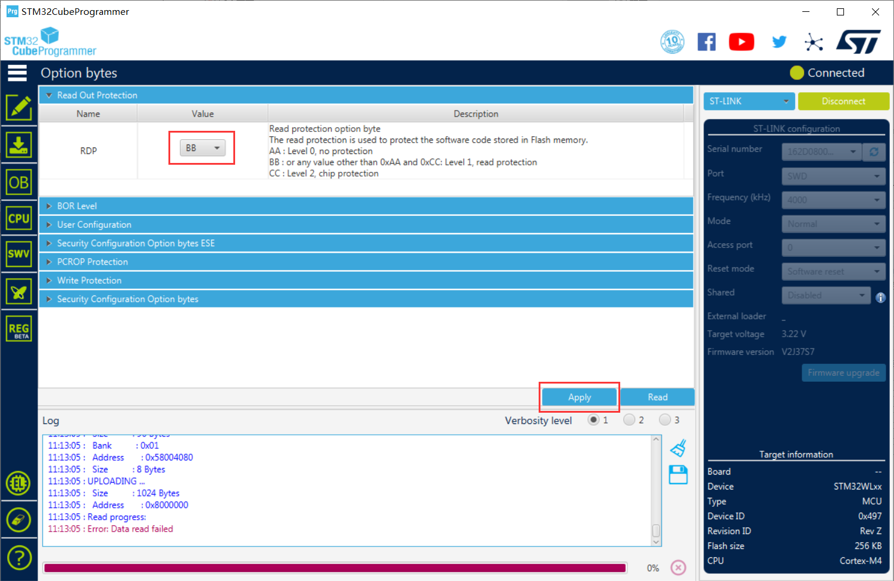
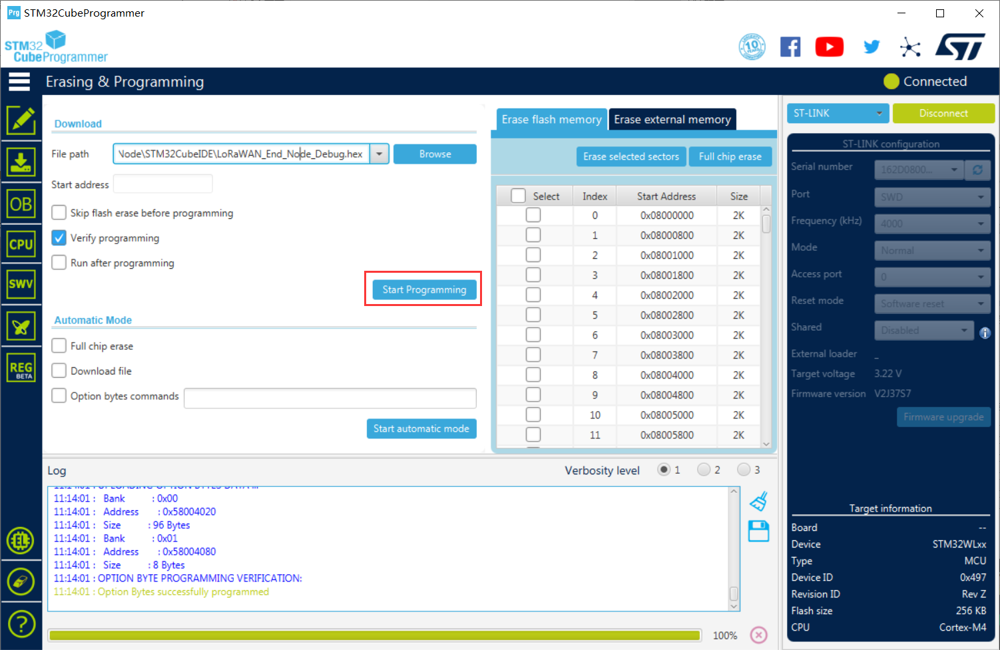
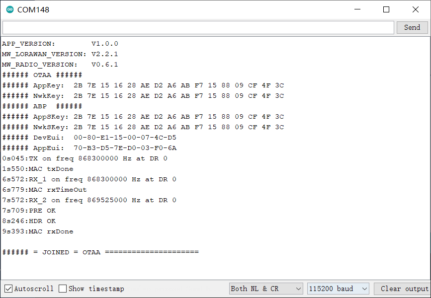

# LoRa-E5-LoRaWAN-End-Node

This wiki is for LoRa-E5 Mini or LoRa-E5 Dev Board, aiming at creating a LoRaWAN End Node with STM32Cube MCU Package for STM32WL series(SDK), to join and send data to LoRaWAN Network.

## Before the start

- Please read [Erase Factory AT Firmware](https://wiki.seeedstudio.com/LoRa_E5_mini/#21-erase-factory-at-firmware) section first, as if we need to erase the Factory AT Firmware before we program with SDK

- Install [STM32CubeIDE(to compilation and debug)](https://my.st.com/content/my_st_com/en/products/development-tools/software-development-tools/stm32-software-development-tools/stm32-ides/stm32cubeide.html) and [STM32CubeProgrammer(to program STM32 devices)](https://my.st.com/content/my_st_com/en/products/development-tools/software-development-tools/stm32-software-development-tools/stm32-programmers/stm32cubeprog.license=1614563305396.product=STM32CubePrg-W64.version=2.6.0.html), also download and extract [STM32Cube MCU Package for STM32WL series(SDK)](https://my.st.com/content/my_st_com/en/products/embedded-software/mcu-mpu-embedded-software/stm32-embedded-software/stm32cube-mcu-mpu-packages/stm32cubewl.license=1608693595598.product=STM32CubeWL.version=1.0.0.html#overview)

- LoRaWAN Gateway connected to LoRaWAN Network Server(e.g. TTN)

- Prepare an USB TypeC cable and a ST-LINK. Connect the TypeC cable to the TypeC port for power and serial communication, connect the ST-LINK to the SWD pins like this:


## GPIO Configuration Overview

- As the hardware design of LoRa-E5 series is a bit different with NUCLEO-WL55JC, the official STM32WL55JC development board from ST, developers need to reconfigure some gpios, to adapt the SDK example to LoRa-E5 series. We have already reconfigured gpios in this example, but we think it is nessary to point out the difference.

|SDK Example Label|GPIO of NUCLEO-WL55JC|GPIO of LoRa-E5 Mini and LoRa-E5 Dev Board|
|---------|---------------------|------------------------------------------|
|RF_CTRL1|PC4|PA4|
|RF_CTRL2|PC5|PA5|
|RF_CTRL3|PC3|None|
|BUT1|PA0|PB13|
|BUT2|PA1|None|
|BUT3|PC6|None|
|LED1|PB15|None|
|LED2|PB9|PB5|
|LED3|PB11|None|
|DBG1|PB12|PA0|
|DBG2|PB13|PB10|
|DBG3|PB14|PB3|
|DBG4|PB10|PB4|
|Usart|Usart2(PA2/PA3)|Usart1(PB6/PB7)|

## Getting Started

### 1. Build the LoRaWAN End Node Example

- Download and copy [this repo](https://github.com/seeed-lora/LoRa-E5-LoRaWAN-End-Node.git) to your SDK folder `en.stm32cubewl\STM32Cube_FW_WL_V1.0.0\Projects\NUCLEO-WL55JC\Applications\LoRaWAN` and replace the origin `en.stm32cubewl\STM32Cube_FW_WL_V1.0.0\Projects\NUCLEO-WL55JC\Applications\LoRaWAN\LoRaWAN_End_Node` folder

- Open the `LoRaWAN_End_Node` example with `STM32CubeIDE`, by double click file `LoRaWAN_End_Node\STM32CubeIDE\.project`

- Click `Build Debug` for this example, it should works without any errors


### 2. Modify your Device EUI and Application EUI

- Please follow the [guide](https://wiki.seeedstudio.com/LoRa_E5_mini/#13-connect-and-send-data-to-ttn) here to setup your TTN application, get your Application EUI and copy it to the macro definition `LORAWAN_JOIN_EUI` in `LoRaWAN/App/se-identity.h` , for example, my Application EUI is `70 B3 D5 7E D0 03 F0 6A` :

```C
// LoRaWAN/App/se-identity.h

/*!
 * App/Join server IEEE EUI (big endian)
 */
#define LORAWAN_JOIN_EUI                                   { 0x70, 0xB3, 0xD5, 0x7E, 0xD0, 0x03, 0xF0, 0x6A }

```

- Also, you can modify your Device EUI, by setting the macro definition `LORAWAN_DEVICE_EUI` in `LoRaWAN/App/se-identity.h` , don't forget to ensure `LORAWAN_DEVICE_EUI` is the same as the `Device EUI` in TTN console.

```C
// LoRaWAN/App/se-identity.h

/*!
 * end-device IEEE EUI (big endian)
 */
#define LORAWAN_DEVICE_EUI                                 { 0x00, 0x80, 0xE1, 0x15, 0x00, 0x07, 0x4C, 0xD5 }

```

- After modification, please **rebuild the example** and program to your LoRa-E5. Make sure the Read Out Protection is `AA`, if it is shown as `BB`, select `AA` and click `Apply`:






### 3. Connect to TTN

- If your LoRaWAN Gateway and TTN are setup, LoRa-E5 will join successfully after reset! A comfirm LoRaWAN package will be sent to TTN every 30 seconds. The following log will come out from the serial port if the join is successful:

```
APP_VERSION:        V1.0.0
MW_LORAWAN_VERSION: V2.2.1
MW_RADIO_VERSION:   V0.6.1
###### OTAA ######
###### AppKey:  2B 7E 15 16 28 AE D2 A6 AB F7 15 88 09 CF 4F 3C
###### NwkKey:  2B 7E 15 16 28 AE D2 A6 AB F7 15 88 09 CF 4F 3C
###### ABP  ######
###### AppSKey: 2B 7E 15 16 28 AE D2 A6 AB F7 15 88 09 CF 4F 3C
###### NwkSKey: 2B 7E 15 16 28 AE D2 A6 AB F7 15 88 09 CF 4F 3C
###### DevEui:  00-80-E1-15-00-07-4C-D5
###### AppEui:  70-B3-D5-7E-D0-03-F0-6A
0s045:TX on freq 868100000 Hz at DR 0
1s550:MAC txDone
6s572:RX_1 on freq 868100000 Hz at DR 0
6s779:MAC rxTimeOut
7s572:RX_2 on freq 869525000 Hz at DR 0
7s709:PRE OK
8s246:HDR OK
9s393:MAC rxDone

###### = JOINED = OTAA =====================
30s068:temp= 25
30s068:VDDA= 254
30s069:TX on freq 868500000 Hz at DR 0
30s082:SEND REQUEST
31s728:MAC txDone
32s750:RX_1 on freq 868500000 Hz at DR 0
32s957:MAC rxTimeOut
33s706:RX_2 on freq 869525000 Hz at DR 3
33s744:PRE OK
33s815:HDR OK
33s897:MAC rxDone

###### ========== MCPS-Confirm =============
```



- Cheers! You have already connected LoRa-E5 to LoRaWAN Network! Can't wait to see you develop some wonderful LoRaWAN End Node applications!